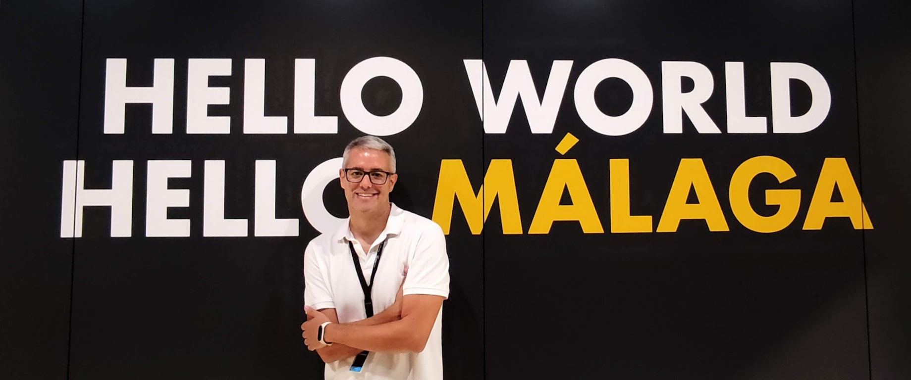

# About
My name is Eliecer and I'm living in Malaga, Spain.

I'm a developer with experience in languages like Java, PHP and Python, as well as technologies like PHP Slim, DDD (Domain-Driven Design) and gRPC. 

I'm currently working at Freepik Company as part of the platform's search engine development team. Currently, we are working on using Artificial Intelligence to find the most relevant images for our users.

